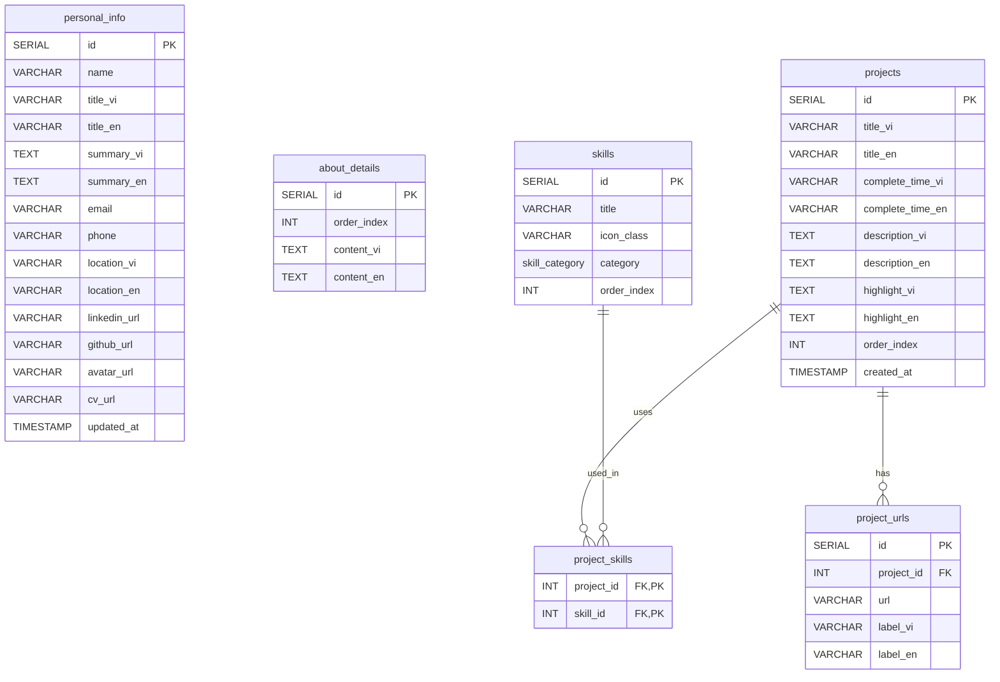

# 🐘 Thiết kế Cơ sở dữ liệu PostgreSQL (Pure Database Design)

Tài liệu này tập trung 100% vào việc thiết kế cấu trúc Cơ sở dữ liệu quan hệ **PostgreSQL** cho hệ thống Portfolio cá nhân, tách biệt hoàn toàn và không phụ thuộc vào bất kỳ framework Backend hay thư viện ORM nào.

---

## 📊 1. Sơ đồ Quan hệ Thực thể (Entity Relationship Diagram - ERD)



---

## 📐 2. Định nghĩa cấu trúc bảng (SQL DDL)

Đoạn mã SQL dưới đây định nghĩa đầy đủ các kiểu dữ liệu, ràng buộc toàn vẹn (Constraints), quan hệ khóa ngoại (Foreign Keys) với cơ chế tự động xóa dữ liệu liên quan (`ON DELETE CASCADE`), và các chỉ mục (Indexes) để tối ưu truy vấn.

```sql
-- Bước 1: Khởi tạo kiểu dữ liệu ENUM cho Phân loại kỹ năng
CREATE TYPE skill_category AS ENUM ('TECH', 'TOOL');

-- Bước 2: Tạo bảng Thông tin cá nhân (Chứa thông tin Header, Landing, Contact info)
CREATE TABLE personal_info (
    id SERIAL PRIMARY KEY,
    name VARCHAR(100) NOT NULL,
    title_vi VARCHAR(255) NOT NULL,
    title_en VARCHAR(255) NOT NULL,
    summary_vi TEXT NOT NULL,
    summary_en TEXT NOT NULL,
    email VARCHAR(100) NOT NULL,
    phone VARCHAR(20) NOT NULL,
    location_vi VARCHAR(150) NOT NULL,
    location_en VARCHAR(150) NOT NULL,
    linkedin_url VARCHAR(255),
    github_url VARCHAR(255),
    avatar_url VARCHAR(255),
    cv_url VARCHAR(255),
    updated_at TIMESTAMP DEFAULT CURRENT_TIMESTAMP
);

-- Bước 3: Tạo bảng Đoạn giới thiệu bản thân (About Me)
CREATE TABLE about_details (
    id SERIAL PRIMARY KEY,
    order_index INT NOT NULL DEFAULT 0,
    content_vi TEXT NOT NULL,
    content_en TEXT NOT NULL
);

-- Tạo Index để tối ưu việc sắp xếp thứ tự hiển thị của các đoạn giới thiệu
CREATE INDEX idx_about_order ON about_details(order_index ASC);

-- Bước 4: Tạo bảng Kỹ năng & Công cụ (Skills & Tools)
CREATE TABLE skills (
    id SERIAL PRIMARY KEY,
    title VARCHAR(50) NOT NULL,
    icon_class VARCHAR(100) NOT NULL,
    category skill_category NOT NULL,
    order_index INT NOT NULL DEFAULT 0
);

-- Tạo Index trên cặp (category, order_index) phục vụ cho việc lọc theo nhóm và sắp xếp
CREATE INDEX idx_skills_cat_order ON skills(category, order_index ASC);

-- Bước 5: Tạo bảng Thông tin Dự án
CREATE TABLE projects (
    id SERIAL PRIMARY KEY,
    title_vi VARCHAR(150) NOT NULL,
    title_en VARCHAR(150) NOT NULL,
    complete_time_vi VARCHAR(50) NOT NULL,
    complete_time_en VARCHAR(50) NOT NULL,
    description_vi TEXT NOT NULL,
    description_en TEXT NOT NULL,
    highlight_vi TEXT NOT NULL,
    highlight_en TEXT NOT NULL,
    order_index INT NOT NULL DEFAULT 0,
    created_at TIMESTAMP DEFAULT CURRENT_TIMESTAMP
);

-- Tạo Index để tối ưu sắp xếp thứ tự các dự án hiển thị
CREATE INDEX idx_projects_order ON projects(order_index ASC);

-- Bước 6: Tạo bảng Các đường dẫn đính kèm của Dự án (Mối quan hệ 1 - Nhiều)
CREATE TABLE project_urls (
    id SERIAL PRIMARY KEY,
    project_id INT NOT NULL,
    url VARCHAR(255) NOT NULL,
    label_vi VARCHAR(50) NOT NULL,
    label_en VARCHAR(50) NOT NULL,
    CONSTRAINT fk_project_url FOREIGN KEY (project_id) 
        REFERENCES projects(id) ON DELETE CASCADE
);

CREATE INDEX idx_project_urls_pid ON project_urls(project_id);

-- Bước 7: Tạo bảng liên kết Nhiều - Nhiều giữa Dự án và Kỹ năng sử dụng
CREATE TABLE project_skills (
    project_id INT NOT NULL,
    skill_id INT NOT NULL,
    PRIMARY KEY (project_id, skill_id),
    CONSTRAINT fk_ps_project FOREIGN KEY (project_id) 
        REFERENCES projects(id) ON DELETE CASCADE,
    CONSTRAINT fk_ps_skill FOREIGN KEY (skill_id) 
        REFERENCES skills(id) ON DELETE CASCADE
);
```

---

## 🔍 3. Các câu lệnh truy vấn mẫu hỗ trợ Đa ngôn ngữ (SQL Query Examples)

Dưới đây là cách viết các câu lệnh SELECT tối ưu để gom nhóm dữ liệu trả về dạng JSON trực tiếp từ PostgreSQL, giúp frontend chỉ cần gọi một câu lệnh duy nhất là có đủ cấu trúc dữ liệu.

### Truy vấn lấy dữ liệu theo Tiếng Việt (`lang = 'vi'`)
```sql
-- 1. Lấy thông tin cá nhân và mảng giới thiệu bản thân
SELECT 
    p.name,
    p.title_vi AS title,
    p.summary_vi AS summary,
    p.email,
    p.phone,
    p.location_vi AS location,
    p.linkedin_url,
    p.github_url,
    p.avatar_url,
    p.cv_url,
    (SELECT json_agg(content_vi ORDER BY order_index ASC) FROM about_details) AS about_mes
FROM personal_info p
LIMIT 1;

-- 2. Lấy danh sách dự án hoàn chỉnh (kèm mảng các liên kết và mảng kỹ năng sử dụng)
SELECT 
    pr.id,
    pr.title_vi AS title,
    pr.complete_time_vi AS complete_time,
    pr.description_vi AS description,
    pr.highlight_vi AS highlight,
    -- Gom nhóm danh sách các link liên kết thành mảng JSON
    COALESCE(
        (SELECT json_agg(json_build_object('label', pu.label_vi, 'url', pu.url)) 
         FROM project_urls pu 
         WHERE pu.project_id = pr.id), 
        '[]'::json
    ) AS urls,
    -- Gom nhóm danh sách tên kỹ năng sử dụng
    COALESCE(
        (SELECT json_agg(s.title) 
         FROM project_skills ps
         JOIN skills s ON ps.skill_id = s.id
         WHERE ps.project_id = pr.id),
        '[]'::json
    ) AS skills
FROM projects pr
ORDER BY pr.order_index ASC;
```

### Truy vấn lấy dữ liệu theo Tiếng Anh (`lang = 'en'`)
```sql
-- 1. Lấy thông tin cá nhân và giới thiệu bằng Tiếng Anh
SELECT 
    p.name,
    p.title_en AS title,
    p.summary_en AS summary,
    p.email,
    p.phone,
    p.location_en AS location,
    p.linkedin_url,
    p.github_url,
    p.avatar_url,
    p.cv_url,
    (SELECT json_agg(content_en ORDER BY order_index ASC) FROM about_details) AS about_mes
FROM personal_info p
LIMIT 1;

-- 2. Lấy dự án bằng Tiếng Anh
SELECT 
    pr.id,
    pr.title_en AS title,
    pr.complete_time_en AS complete_time,
    pr.description_en AS description,
    pr.highlight_en AS highlight,
    COALESCE(
        (SELECT json_agg(json_build_object('label', pu.label_en, 'url', pu.url)) 
         FROM project_urls pu 
         WHERE pu.project_id = pr.id), 
        '[]'::json
    ) AS urls,
    COALESCE(
        (SELECT json_agg(s.title) 
         FROM project_skills ps
         JOIN skills s ON ps.skill_id = s.id
         WHERE ps.project_id = pr.id),
        '[]'::json
    ) AS skills
FROM projects pr
ORDER BY pr.order_index ASC;
```

---

## 🗃️ 4. Tập lệnh SQL Seed Data (Dữ liệu mẫu chuẩn của bạn)

```sql
-- Xóa sạch dữ liệu cũ và khởi động lại ID tự tăng (SERIAL)
TRUNCATE TABLE personal_info, about_details, project_urls, project_skills, projects, skills RESTART IDENTITY CASCADE;

-- 1. Nạp dữ liệu vào bảng personal_info
INSERT INTO personal_info (
    name, title_vi, title_en, 
    summary_vi, summary_en, 
    email, phone, 
    location_vi, location_en, 
    linkedin_url, github_url, 
    avatar_url, cv_url
) VALUES (
    'PHAN CÔNG CHÂU',
    'Xin chào, tôi là Phan Công Châu',
    'Hi, I am Phan Cong Chau',
    'Là một fullstack developer đam mê xây dựng các giải pháp web toàn diện, lấy người dùng làm trung tâm và không ngừng phát triển để mang lại trải nghiệm số chất lượng cao.',
    'A fullstack developer passionate about building user-centered comprehensive web solutions, constantly growing to deliver high-quality digital experiences.',
    'congchau206@gmail.com',
    '0703913350',
    'TP Hồ Chí Minh',
    'Ho Chi Minh City',
    'https://www.linkedin.com/in/phancongchau20062004/',
    'https://github.com/Cong-Chau',
    '/images/avatar.jpg',
    '/pdfs/PhanCongChau_CV_FullStack_Intern.pdf'
);

-- 2. Nạp dữ liệu giới thiệu bản thân vào about_details
INSERT INTO about_details (order_index, content_vi, content_en) VALUES
(1, 'Xin chào, tôi là Phan Công Châu.', 'Hello, I am Phan Cong Chau.'),
(2, 'Tôi tập trung vào phát triển web fullstack, hướng đến việc tạo ra những trải nghiệm số mượt mà, hiệu quả và thẩm mỹ.', 'I focus on fullstack web development, aiming to create smooth, efficient, and aesthetic digital experiences.'),
(3, 'Tôi yêu thích cả frontend và backend, biến ý tưởng thành các ứng dụng web hoàn chỉnh.', 'I love both frontend and backend, turning ideas into complete web applications.'),
(4, 'Tôi luôn học hỏi và khám phá công nghệ mới để nâng cao kỹ năng và bắt kịp xu hướng phát triển hiện đại.', 'I always learn and explore new technologies to enhance skills and catch up with modern development trends.'),
(5, 'Mục tiêu của tôi là xây dựng những sản phẩm web chất lượng cao, có khả năng mở rộng và mang lại giá trị thực cho người dùng.', 'My goal is to build high-quality, scalable web products that bring real value to users.');

-- 3. Nạp danh sách các Kỹ năng (id cố định để liên kết khóa ngoại dễ dàng ở bảng project_skills)
INSERT INTO skills (id, title, icon_class, category, order_index) VALUES
(1, 'HTML5', 'devicon-html5-plain colored', 'TECH', 1),
(2, 'CSS3', 'devicon-css3-plain colored', 'TECH', 2),
(3, 'JavaScript', 'devicon-javascript-plain colored', 'TECH', 3),
(4, 'React JS', 'devicon-react-original colored', 'TECH', 4),
(5, 'Tailwind CSS', 'devicon-tailwindcss-original colored', 'TECH', 5),
(6, 'Node JS', 'devicon-nodejs-plain colored', 'TECH', 6),
(7, 'Github', 'devicon-github-original', 'TOOL', 1),
(8, 'MySQL', 'devicon-mysql-original colored', 'TOOL', 2),
(9, 'Postman', 'devicon-postman-plain colored', 'TOOL', 3);

-- Đồng bộ hóa lại sequence tự tăng cho bảng skills
SELECT setval('skills_id_seq', (SELECT MAX(id) FROM skills));

-- 4. Nạp thông tin dự án thực tế vào projects
-- Dự án 1
INSERT INTO projects (id, title_vi, title_en, complete_time_vi, complete_time_en, description_vi, description_en, highlight_vi, highlight_en, order_index) VALUES
(1, 
 'ACCI Exam Management System', 'ACCI Exam Management System',
 '08/2025 - Hiện tại', '08/2025 - Now',
 'Hệ thống quản lý thi chứng chỉ Anh ngữ & Tin học ACCI, hỗ trợ đăng ký, thanh toán, gia hạn, phát hành phiếu dự thi và cấp chứng chỉ.',
 'ACCI English & IT Certificate Exam Management System supporting registration, payment, renewal, exam slip issuance, and certification.',
 'Triển khai FE/BE tách biệt, mô hình hóa đầy đủ quy trình nghiệp vụ từ đăng ký đến cấp chứng chỉ.',
 'Deployed separated FE/BE architecture, modeled full business workflow from registration to certification.',
 1
);

-- Dự án 2
INSERT INTO projects (id, title_vi, title_en, complete_time_vi, complete_time_en, description_vi, description_en, highlight_vi, highlight_en, order_index) VALUES
(2,
 'Nền tảng tạo video bằng AI', 'AI Video Generation Platform',
 '05/2025 - 07/2025', '05/2025 - 07/2025',
 'Nền tảng web cho phép tạo video ngắn tự động từ văn bản, tích hợp Text-to-Speech, chuyển ảnh thành video và sinh phụ đề tự động.',
 'A web platform that generates short videos from text, integrated with Text-to-Speech, image-to-video, and auto subtitles.',
 'Kết hợp frontend React + Tailwind với backend Python xử lý AI, đơn giản hóa quy trình tạo video.',
 'Combined React + Tailwind frontend with Python AI backend, simplifying video creation.',
 2
);

-- Dự án 3
INSERT INTO projects (id, title_vi, title_en, complete_time_vi, complete_time_en, description_vi, description_en, highlight_vi, highlight_en, order_index) VALUES
(3,
 'Hệ thống quản lý nhà hàng', 'Restaurant Management System',
 '11/2024 - 12/2024', '11/2024 - 12/2024',
 'Ứng dụng quản lý nhà hàng với đặt món, đặt bàn, quản lý thực đơn và thống kê doanh thu. Dự án nhóm 5 người thực hiện theo mô hình MVC.',
 'Restaurant management app featuring ordering, table booking, menu management, and revenue analytics. 5-member team MVC project.',
 'Tích hợp xác thực người dùng, phân quyền quản lý/nhân viên, báo cáo doanh thu trực quan.',
 'Integrated user authentication, role-based access control, and visual revenue reporting.',
 3
);

-- Dự án 4
INSERT INTO projects (id, title_vi, title_en, complete_time_vi, complete_time_en, description_vi, description_en, highlight_vi, highlight_en, order_index) VALUES
(4,
 'Hệ thống quản lý đại lý', 'Agency Management System',
 '11/2024 - 12/2024', '11/2024 - 12/2024',
 'Ứng dụng quản lý hàng hóa, nhập - xuất và báo cáo doanh thu. Dự án nhóm 4 người phát triển theo mô hình MVC.',
 'Goods management, import-export tracking, and revenue reporting. 4-member team MVC project.',
 'Thống kê doanh thu trực quan, hỗ trợ quản lý nắm bắt hiệu quả kinh doanh nhanh chóng.',
 'Visual sales statistics helping managers grab business efficiency quickly.',
 4
);

-- Dự án 5
INSERT INTO projects (id, title_vi, title_en, complete_time_vi, complete_time_en, description_vi, description_en, highlight_vi, highlight_en, order_index) VALUES
(5,
 'Remote Desktop', 'Remote Desktop',
 '11/2024 - 12/2024', '11/2024 - 12/2024',
 'Ứng dụng điều khiển máy tính từ xa trong LAN theo mô hình client-server, truyền hình ảnh màn hình, điều khiển chuột và bàn phím.',
 'LAN remote desktop control application based on Client-Server model, screen streaming, mouse/keyboard inputs.',
 'Ứng dụng lập trình socket, đa luồng để tối ưu hiệu suất truyền dữ liệu, giảm độ trễ.',
 'Applied socket programming and multithreading to optimize data streaming performance, reducing latency.',
 5
);

-- Dự án 6
INSERT INTO projects (id, title_vi, title_en, complete_time_vi, complete_time_en, description_vi, description_en, highlight_vi, highlight_en, order_index) VALUES
(6,
 'Quản lý khóa học (Console App)', 'Course Management (Console App)',
 '04/2023 - 06/2023', '04/2023 - 06/2023',
 'Ứng dụng console bằng C++ để quản lý học viên, khóa học, đăng ký học và phân loại kết quả.',
 'Console application using C++ to manage students, courses, registrations, and grades.',
 'Ứng dụng đầy đủ CRUD trong môi trường console, rèn luyện kỹ năng cấu trúc dữ liệu và lập trình hướng đối tượng.',
 'Implemented full CRUD features in console, practicing OOP and data structures.',
 6
);

-- Đồng bộ hóa sequence tự tăng cho bảng projects
SELECT setval('projects_id_seq', (SELECT MAX(id) FROM projects));

-- 5. Nạp URLs tương ứng cho từng Dự án (Khóa ngoại project_id)
INSERT INTO project_urls (project_id, url, label_vi, label_en) VALUES
(1, 'https://github.com/Cong-Chau/ACCI-Client', 'Client Repo', 'Client Repo'),
(1, 'https://github.com/Cong-Chau/ACCI-Server', 'Server Repo', 'Server Repo'),
(2, 'https://github.com/Cong-Chau/GenerateVideo/tree/main-chau', 'GitHub', 'GitHub'),
(3, 'https://github.com/Cong-Chau/Restaurant', 'GitHub', 'GitHub'),
(4, 'https://github.com/Cong-Chau/AgentManager', 'GitHub', 'GitHub'),
(5, 'https://github.com/Cong-Chau/RemoteDesktop', 'GitHub', 'GitHub'),
(6, 'https://github.com/Cong-Chau/CourseManage', 'GitHub', 'GitHub');

-- 6. Nạp liên kết khóa ngoại Nhiều - Nhiều giữa các dự án và kỹ năng tương ứng
-- (Kỹ năng: 4:React, 5:Tailwind, 6:NodeJS, 8:MySQL)
INSERT INTO project_skills (project_id, skill_id) VALUES
-- ACCI Exam Management sử dụng: React (4), Tailwind (5), NodeJS (6), MySQL (8)
(1, 4), (1, 5), (1, 6), (1, 8),
-- AI Video Platform sử dụng: React (4), Tailwind (5)
(2, 4), (2, 5),
-- Restaurant Management sử dụng: NodeJS (6), MySQL (8)
(3, 6), (3, 8),
-- Agency Management sử dụng: NodeJS (6), MySQL (8)
(4, 6), (4, 8);
```
